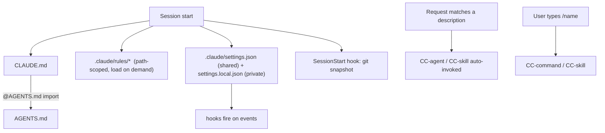

# Claude Code setup for Pantheon

This repo ships a curated **Claude Code** configuration under `.claude/` (plus a root `CLAUDE.md`
and a project `.mcp.json`). It is tuned for Pantheon's stack — Python 3.12 CLI + FastAPI backend and
a React 19 / Vite / TypeScript / Tailwind v4 frontend — and for the local-`claude`-CLI generation
backend (no hosted-LLM API keys).

> **Pantheon-agent/skill** = the product's *own* in-app framework (`agents/`, `core/intelligence`,
> `AgentSkill`, `skills/*.yaml`). **CC-agent/skill/command** = the Claude Code helpers below. They
> are different layers — don't conflate them.

## What loads, and when

## Files

### Memory & rules
- **`CLAUDE.md`** (root) — lean operating guide; imports `@AGENTS.md` (Claude Code does not read
  `AGENTS.md` natively). Holds commands, the 6-known-Windows-failures test baseline, git/commit
  policy, and the `.claude/` map.
- **`.claude/rules/`** — path-scoped guidance loaded only when Claude touches matching files:
  `python.md` (`**/*.py`), `frontend.md` (`web/frontend/**/*.{ts,tsx}`), `web-api.md` (`web/server.py`).

### settings (committed) vs settings.local (private)
- **`.claude/settings.json`** (committed, shared) — the safety baseline: `permissions.deny` for
  reading secrets, `ask` on `rm -rf`/`rmdir`, and all hook wiring. Portable (`${CLAUDE_PROJECT_DIR}`).
- **`.claude/settings.local.json`** (gitignored, per-machine) — broad `allow` for autonomy, and the
  **`env.PATH`** that puts the winget Node + the project `.venv\Scripts` on PATH so `node`, `npx`,
  `python`, `ruff`, `pytest` resolve. ⚠️ Edit this on a new machine to point at its Node/venv paths.

### hooks (`.claude/hooks/`, Node)
See `.claude/hooks/README.md`. Summary: `guard-bash` + `protect-secrets` (PreToolUse deny),
`format` (PostToolUse ruff format, async), `post-edit-checks` (PostToolUse dispatcher — runs
config-validation / flows / planning-doc checks in **one** node process, each gated by file path;
replaced 3 separate serial hooks), `session-context` (SessionStart git snapshot),
`auto-commit` (Stop; branches off main, commits with Co-Authored-By, pushes).

### CC-subagents (`.claude/agents/`)
Model-tiered by cognitive load — heavy reasoning on Opus, implementation on Sonnet,
mechanical/monitoring on Haiku — so routine work doesn't burn the expensive tier:
- **Opus** (deep reasoning): `code-reviewer` (read-only diff review), `debugger` (root-cause + minimal fix).
- **Sonnet** (implementation / judgment): `frontend-dev` (React/Vite/TS), `flow-auditor` (per-flow health).
- **Haiku** (mechanical / monitoring, low-cost): `test-triage` (run suites, match against the 6 known
  failures), `trend-watcher` (surface Claude Code/Anthropic trends → `.claude/` config suggestions,
  read-only), `doc-writer` (keep docs in sync; honors the planning-doc hygiene rule).

Pick the tier by the task's hardest sub-step, not its length: a long-but-mechanical task (run tests,
match a known list) is Haiku; a short-but-subtle one (is this a real security bug?) is Opus.

### CC-skills (`.claude/skills/`)
- `run-pantheon` — launch/smoke-check recipe.
- `pantheon-agent` (+ `reference.md`) — add a Pantheon-agent / `AgentSkill` correctly.
- `improvement-proposal-flow` — the analyze→propose→approve→apply lifecycle.
- `fastapi-endpoint` — add/modify a FastAPI route + test.

### CC-commands (`.claude/commands/`)
- `/add-cli-command`, `/add-web-page`, `/triage-tests`.

### MCP (`.mcp.json`, project scope)
- **context7** (HTTP, no secret) — version-pinned library docs (React 19 / Vite / Tailwind / FastAPI),
  countering the model's knowledge cutoff. Also surfaced as the `mcp__context7__*` tools.
- **playwright** (`npx @playwright/mcp`) — drive the React frontend for `/verify`-style checks.
  (Needs `npx` on PATH — provided by `env.PATH`.)

### Output styles (`.claude/output-styles/`)
- `diagram-first` — optional; lead architecture explanations with a Mermaid diagram. Select via
  `/config` (it is not active by default).

## First-run on a new machine
1. Create the backend venv and install deps: `pip install -e ".[dev,web]"` (includes `ruff`).
2. `npm install` in `web/frontend/`.
3. Edit `.claude/settings.local.json` → `env.PATH` to your machine's Node + `.venv\Scripts` paths.
4. **Restart the Claude Code session** so `env.PATH` and hooks load.
5. Authenticate the backend once: run `claude`.

## Maintaining this setup
- Keep `CLAUDE.md` < ~150 lines; push path-specific detail into `.claude/rules/`.
- Enforce hard rules with hooks / `permissions.deny`, not prose (CLAUDE.md is advisory, ~70% adherence).
- After changing hooks/settings, start a fresh session to reload.
