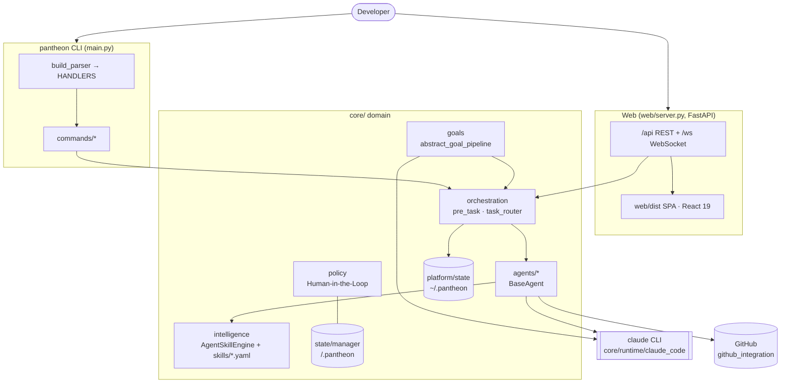
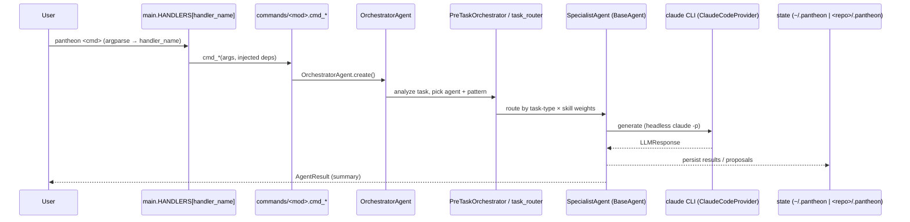
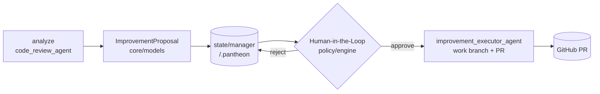

# Pantheon — architecture overview (diagrams)

Visual companion to `AGENTS.md` and `docs/architecture.md`. All generation flows through the local
`claude` CLI — there are no hosted-LLM API keys.

## System context

## CLI request flow

## ImprovementProposal lifecycle

## Layer responsibilities (quick map)

| Layer | Responsibility |
|---|---|
| `main.py` / `commands/` | CLI entrypoint; parser → `HANDLERS` → `cmd_*` (dep injection) |
| `agents/` | `BaseAgent` framework (review, executor, explorer, orchestrator, …) |
| `core/orchestration` | pre-task meta-analysis, routing, learned execution patterns |
| `core/intelligence` | skill engine, capability registry/gap analysis, codebase index |
| `core/goals` | NL goal → org gen → plan → execute → verify |
| `core/policy` · `quality` · `metrics` | approval gating; self-improvement loop; health/growth |
| `core/platform` · `state` | global `~/.pantheon` vs per-repo `<repo>/.pantheon` |
| `core/runtime` | `claude_code` provider (sole backend) + wmux multiplexer |
| `web/` | FastAPI API (`/api`, `/ws`, explicit 404) + React 19/Vite/Tailwind SPA |
| `github_integration/` | PR creation & repo linkage |
