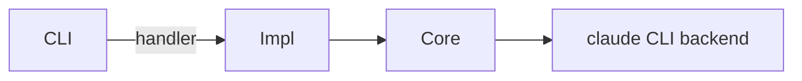

# Feature spec: <name>

- **Owner:** · **Status:** Draft | Review | Approved · **Date:** YYYY-MM-DD

## 1. Summary
<!-- 2–3 sentences: what we're building and for whom. -->

## 2. Problem & goals
- Problem:
- Goals (measurable):
- Non-goals:

## 3. User-facing surface
<!-- Pick what applies and sketch it. -->
- **CLI:** `pantheon <group> <verb> [...]` — behavior, output, errors.
- **Web API:** method + path under `/api`, request/response shape (Pydantic), error/404 behavior.
- **Frontend:** page/route, key components, data source (`lib/api.ts`), states (loading/empty/error).

## 4. Design
<!-- Which layer(s): core/ subpackage, agents/, commands/, web/. Data models (Pydantic), state
     location (~/.pantheon vs <repo>/.pantheon), and the request/control flow. A Mermaid diagram helps. -->

## 5. Test plan
- Backend: `tests/test_<feature>.py` (pytest, `tmp_path` + `monkeypatch get_platform_home`).
- Frontend (if any): co-located `__tests__/*.test.tsx` (vitest).
- Edge cases / failure modes:

## 6. Rollout & risks
- Migration / backward-compat (existing persisted JSON?):
- Risks & mitigations:
- Follow-ups:
